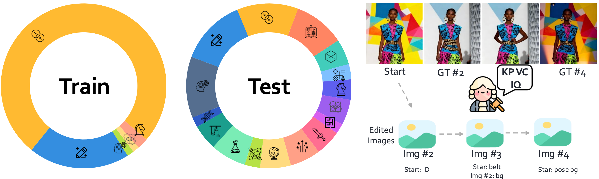

<h1 align="center" style="line-height: 50px;">
  WEAVE: Unleashing and Benchmarking the Interleaved Cross-modality Comprehension and Generation
</h1>

<div align="center">

[](https://arxiv.org/abs/2511.11434)
[](https://huggingface.co/datasets/WeiChow/Weave/)
[](https://huggingface.co/WeiChow/Bagel-weave)
[](https://github.com/weichow23/weave)
[](https://weichow23.github.io/weave/)

</div>

> 📌 This is the official implementation and benchmark evaluation repository of 
> **Unleashing and Benchmarking the Interleaved Cross-modality Comprehension and Generation**



## 🔍 Introduction

[Your introduction content will go here]

## 📁 Repository Structure
```shell
.
├── eval/                  # Evaluation scripts
│   ├── config.py          # Configuration settings
│   ├── main.py            # Main evaluation pipeline
│   ├── prompts.py         # Evaluation prompts
│   ├── summarize.py       # Results summarization
│   ├── utils.py           # Utility functions
│   └── vlm_tools.py       # GPT implementation
├── infer/                 # Inference tools
│   ├── case_bagel.py      # Example for combined tasks
│   ├── case_gpt.py        # Example for VQA tasks
│   ├── case_step1x.py     # Example for image generation
│   └── loader.py          # Data loading utilities
└── vis.ipynb              # Visualization notebook
```

## 🚀 Testing Your Model on WeaveBench

### 📥 Inference

First, prepare the test dataset:
```bash
mkdir <YOUR_DATA_PATH>
cd <YOUR_DATA_PATH>
huggingface-cli download WeiChow/WEAVE --include test/ --repo-type dataset --local-dir .
cd test
unzip test.zip
```
‼️: Then edit the `ROOT_PATH` in `loader.py`

The test set file format (`test.json`) is as follows:

> ⚠️ **Note**: `Image #1` references the first image, starting from 1. This represents the image index, not the conversation turn. It corresponds to the first image in the `images` array (`images[0]`).
> When using multi-turn conversations, each number index should be replaced once with `Image #{idx}<image>\n`. For single-turn, simply replace directly.

```json
{
    "domain": str,
    "images": [],
    "chats": [

    ]
}
```

### ⚙️ Running Inference

The `infer/` directory contains tools for inference. To use WeaveBench, you only need to copy `loader.py` and integrate it with your model.

For your convenience, we provide three example scenarios:
- 🖼️ Image generation inference only (`case_step1x.py`)
- 💬 VQA task inference only (`case_gpt.py`)
- 🔄 Combined inference for both image generation and VQA tasks (`case_bagel.py`)

⚠️ **Important**: When testing text generation alone, be sure to set the modality to "unified" and skip with `if chat[1]['type'] != 'text':`. Otherwise, the text's ending index may be incorrect.

### 📊 Evaluation
Use the `eval/` directory for testing scores:
```bash
pip3 install -r requirements.txt
```

Set the GPT config in `eval/config.py`.
```bash
ROOT_PATH = <YOUR_DATA_PATH>
OPENAI_MODEL =  <MODEL> # like 'gpt-4o-2024-08-06'
AZURE_API_KEY = <YOUR KEY>
AZURE_ENDPOINT = <YOUR ENDPOINT> # like "https://api.openai.com/v1/chat/completions"
```

To run evaluation:
```bash
python3 eval/main.py --input_dir result/bagel/imgs --output_dir result/bagel/ --mode img
python3 eval/summarize.py --metrics_file result/bagel/metrics.jsonl
```

The `input_dir` is the location where you saved images after inference (e.g., `result/bagel/imgs`).
The `output_dir` is where you store GPT evaluation results.
The `mode` parameter has three options: `img`, `txt`, or `umm`. Please select the appropriate evaluation mode.

> 💡 **Tip**: Since we require GPT to output in JSON format, some items may not be scored due to format errors. You can rerun the first script to score these items; it will automatically skip already scored content.

### 📏 Evaluation Metrics
WeaveBench evaluates 4 core metrics:

| Metric | Code | Description | Requires Text | Requires Image |
|--------|------|-------------|---------------| ---------------|
| **Key Point Correctness** | KP | Measures whether the edited image satisfies the specified editing requirements. | ❌ No | ✅ Yes |
| **Visual Consistency** | VC | Ensures non-target elements remain unchanged and maintains consistency with the original image. | ❌ No | ✅ Yes |
| **Image Quality** | IQ | Evaluates the overall quality of the generated image. | ❌ No | ✅ Yes | 
| **Accuracy** | ACC | Measures the correctness of the reasoning result for comprehension tasks. | ✅ Yes | ❌ No |

Consider adding your results to our leaderboard at [Weave Project Page](https://weichow23.github.io/weave/). Please contact weichow@qq.com for submission details!

## 📚 Citation

```bibtex
@article{
    
}
```
